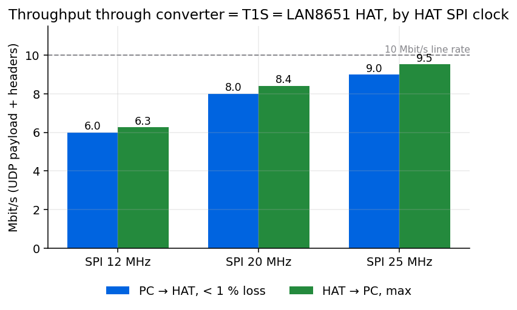
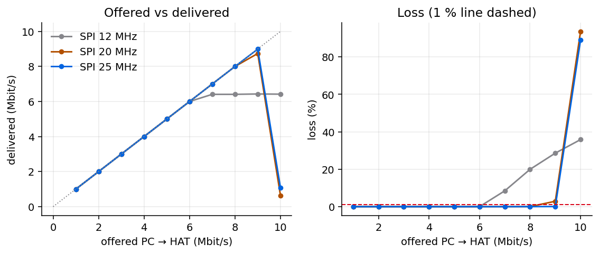
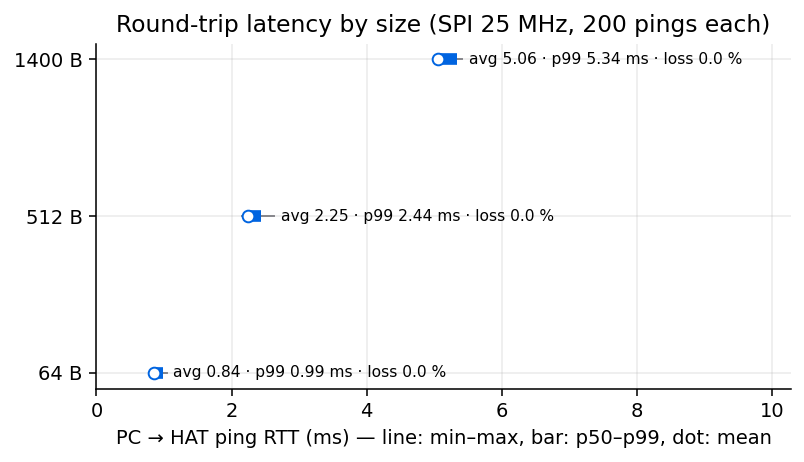
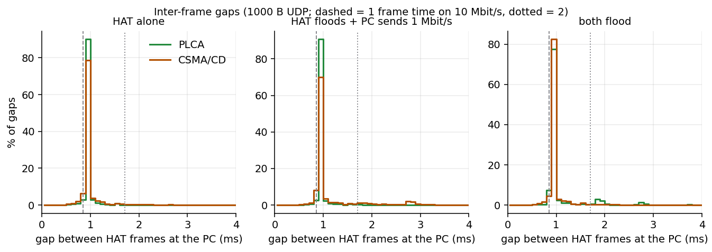
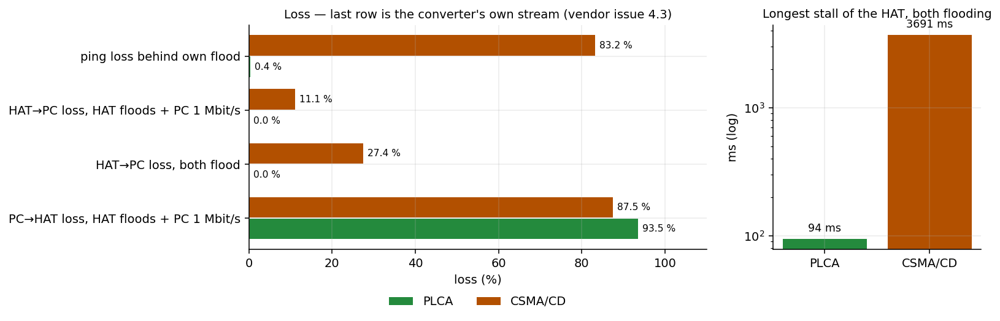

# 10BASE-T1S bench report

_Generated 2026-10-01 15:43 by `pc/t1s_console/make_report.py` from `data/`._

```
PC enp4s0 ─RJ45─ TSN Lab 10Base-T1S Converter ═10BASE-T1S═ TSN Lab LAN8651 HAT ─SPI─ ESP32-S3 (t1s_node)
```

The HAT runs `t1s_node` (elite-t1s-hat repo): Espressif's LAN865x driver on SPI3, lwIP, UDP echo/sink, and optionally zenoh-pico over the T1S interface. The converter is the PLCA coordinator (dial ID 0 / count 2) unless stated; the HAT is ID 1.

## Headline (SPI 25 MHz)

| | |
|---|---|
| ping RTT, 64 B | 0.845 ms avg, p99 0.989 ms, 0 loss |
| PC → HAT without loss | 8.99 Mbit/s |
| HAT → PC | 9.52 Mbit/s |
| 60 s at 10 pings/s | 0.0 % loss |

## Throughput by SPI clock



Every frame crosses the ESP32↔LAN8651 SPI link (OPEN Alliance TC6), so its clock sets the ceiling: 12 MHz tops out near 6.4 Mbit/s, 25 MHz reaches ~95 % of the 10 Mbit/s line.

## Load sweep



## Latency



RTT grows with size because each frame is clocked onto the 10 Mbit/s wire twice (request and reply): a 1400 B ping spends ~2.3 ms on the wire alone.

## PLCA vs CSMA/CD

PLCA as read from the HAT: 2 nodes, transmit opportunity 32 bit times (3.2 µs), max burst 0 → idle cycle ≈ 8.4 µs, worst wait behind one 1518 B frame ≈ 1.239 ms.





PLCA removes collisions: the node with a PLCA-capable MAC (the LAN8651 HAT) lost nothing in any phase, where CSMA/CD lost up to 27 % and stalled it for seconds under contention. The converter's own stream is starved in both modes — the vendor's manual lists bidirectional traffic through the converter as a LAN8670 issue not fixable in software (issue 4.3).

## Files

- per-run reports: `t1s_hat_*.md` (full tests), `t1s_plca_*.md` (PLCA demo)
- comparison table: `PLCA_vs_CSMA_20261001.md`
- raw data: `data/`
