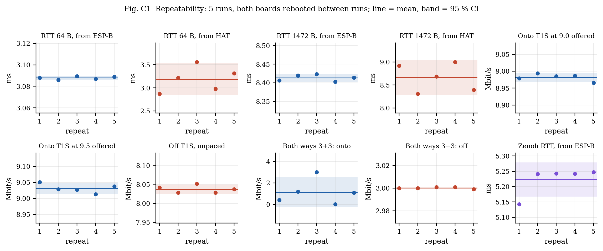
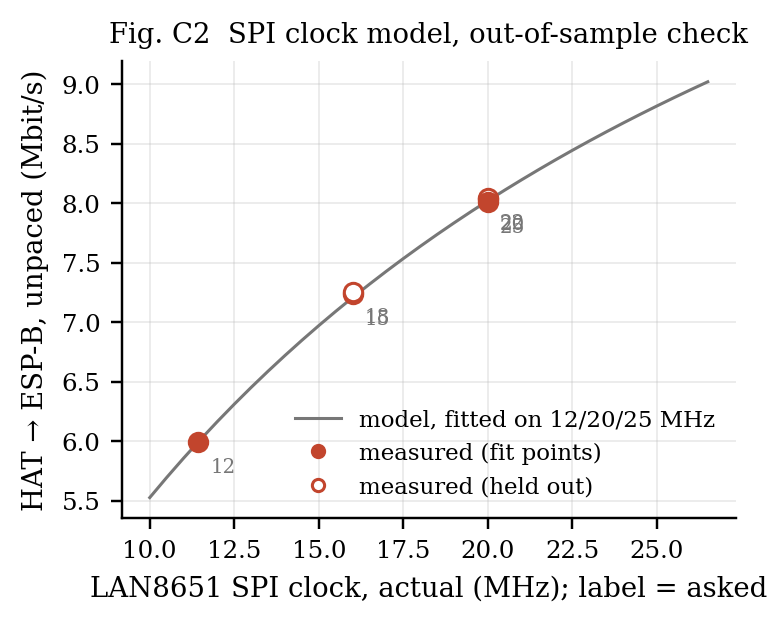
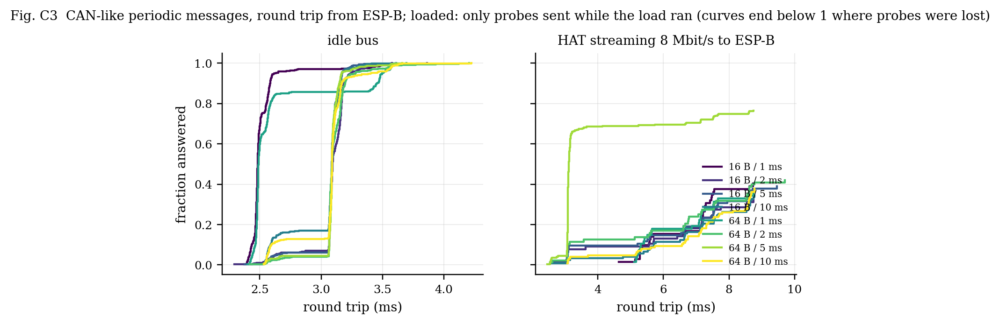
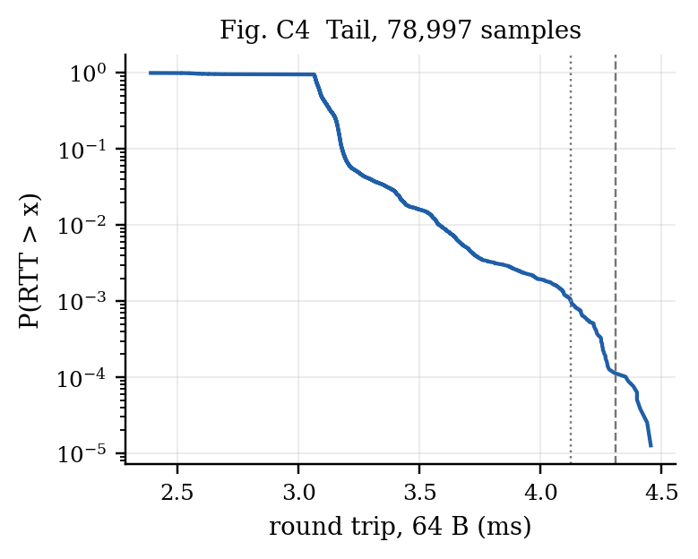
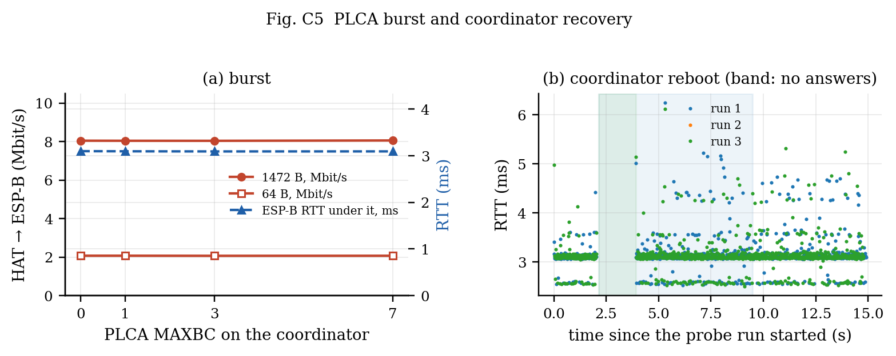

# Two-board T1S campaign: repeatability, SPI model check, periodic traffic, tail, recovery

*Run 2026-10-06 14:45:31 — `campaign_20261006_144531.json`, generated by `make_campaign_report.py`. Intervals are 95 % (Student t over the repeats).*

**Setup.** esp32-5: ESP32-S3 + LAN8651 HAT, PLCA on (id 0 of 2), SPI 25 MHz asked, 20.00 MHz actual, 192.168.100.65. esp32-7: ESP32-S3 W5500 at 192.168.100.66 on the converter's 100BASE-TX port. Converter: LAN8670 + LAN9355, ID 1 / count 0 (not coordinating). All traffic generated and measured by the two boards; Zenoh's periodic traffic paused except in its own measurements.

## 1. Repeatability (5 runs, both boards rebooted between runs)

| metric | per run | mean ± 95 % CI | spread (max−min) |
|---|---|---|---|
| RTT 64 B, from ESP-B | 3.088 / 3.086 / 3.090 / 3.087 / 3.089 | **3.088 ± 0.002 ms** | 0.004 |
| RTT 64 B, from HAT | 2.867 / 3.219 / 3.558 / 2.975 / 3.314 | **3.187 ± 0.341 ms** | 0.691 |
| RTT 1472 B, from ESP-B | 8.406 / 8.420 / 8.423 / 8.402 / 8.414 | **8.413 ± 0.011 ms** | 0.021 |
| RTT 1472 B, from HAT | 8.915 / 8.303 / 8.685 / 8.998 / 8.392 | **8.659 ± 0.382 ms** | 0.694 |
| Onto T1S at 9.0 offered | 8.979 / 8.994 / 8.985 / 8.987 / 8.966 | **8.982 ± 0.013 Mbit/s** | 0.028 |
| Onto T1S at 9.5 offered | 9.051 / 9.029 / 9.027 / 9.013 / 9.038 | **9.032 ± 0.017 Mbit/s** | 0.038 |
| Off T1S, unpaced | 8.041 / 8.028 / 8.052 / 8.028 / 8.037 | **8.037 ± 0.012 Mbit/s** | 0.024 |
| Both ways 3+3: onto | 0.405 / 1.193 / 2.997 / 0.033 / 1.093 | **1.144 ± 1.418 Mbit/s** | 2.964 |
| Both ways 3+3: off | 3.000 / 3.000 / 3.001 / 3.001 / 2.999 | **3.000 ± 0.001 Mbit/s** | 0.002 |
| Zenoh RTT, from ESP-B | 5.143 / 5.241 / 5.243 / 5.242 / 5.247 | **5.223 ± 0.056 ms** | 0.104 |

**Stable across reboots** (95 % CI under 1 % of the mean): RTT 64 B, from ESP-B, RTT 1472 B, from ESP-B, Onto T1S at 9.0 offered, Onto T1S at 9.5 offered, Off T1S, unpaced, Both ways 3+3: off.

- **RTT 64 B, from HAT** moves between runs (2.87–3.56 ms) while staying tight within a run. The HAT's probe timer and ESP-B's 1 ms W5500 poll start at an arbitrary phase after each boot, and the reply waits for that poll: a reboot reshuffles the phase. Seen from ESP-B, which owns the poll, the same path is stable.
- **RTT 1472 B, from HAT** moves between runs (8.30–9.00 ms) while staying tight within a run. The HAT's probe timer and ESP-B's 1 ms W5500 poll start at an arbitrary phase after each boot, and the reply waits for that poll: a reboot reshuffles the phase. Seen from ESP-B, which owns the poll, the same path is stable.
- **Both ways 3+3: onto**: the converter's stream onto T1S fell short of the 3 Mbit/s offered in **4 of 5 runs** (0.41 / 1.19 / 3.00 / 0.03 / 1.09 Mbit/s), from a total stall to none. The collapse is real but not deterministic; a single run can show anything from 0 to 3 Mbit/s, which is why repeats were needed to state it.
- **Zenoh RTT, from ESP-B**: 5.223 ± 0.056 ms.

## 2. SPI clock: model fitted on the 12/20/25 MHz settings, checked on 15/18/22 MHz

Model: every 1472 B datagram costs a fixed **t0 = 828 µs** plus **k/f = 13638 µs·MHz / f** of SPI time, fitted on the fit clocks only. With 24 TC6 chunks of 68 B per frame, k corresponds to **c = 1.04** clock periods per transferred bit (1.00 would be the bare chunk transfer).

| SPI MHz asked → actual | role | measured (Mbit/s) | model (Mbit/s) | error | 512 B unpaced | onto T1S at 9.5 | RTT 1472 B from HAT (ms) |
|---|---|---|---|---|---|---|---|
| 12 → 11.43 | fit | 5.993 | 5.993 | +0.0 % | 4.899 | 6.599 | 9.85 |
| 15 → 16.00 | held out | 7.240 | 7.209 | +0.4 % | 5.714 | 8.045 | 8.46 |
| 18 → 16.00 | held out | 7.258 | 7.209 | +0.7 % | 5.705 | 8.056 | 8.50 |
| 20 → 20.00 | fit | 8.035 | 8.022 | +0.2 % | 6.226 | 9.036 | 8.39 |
| 22 → 20.00 | held out | 8.044 | 8.022 | +0.3 % | 6.240 | 9.033 | 8.42 |
| 25 → 20.00 | fit | 8.010 | 8.022 | -0.2 % | 6.244 | 9.033 | 8.42 |

Held-out error: mean **0.5 %**, worst **0.7 %**.

**The clock asked for is not the clock that runs.** The ESP32-S3's SPI peripheral divides 80 MHz by an integer, and the firmware never lets it exceed the LAN8651's 25 MHz (DS60001734F, Table 9-9), so the boards ran: 12 → 11.43, 15 → 16.00, 18 → 16.00, 20 → 20.00, 22 → 20.00, 25 → 20.00. In spec the fit rests on two clocks (11.43 and 20 MHz) and the held-out settings add one new clock (16 MHz, asked as 15 and 18) and repeat 20 MHz (asked as 22): one prediction, one repeatability check. The model is fitted and drawn against the actual clock.

## 3. CAN-like periodic messages

Sequential probes (one in flight), so the effective period is max(period, round trip). Under load only the probes sent while the load was running are counted (each probe's start time is rebuilt from the intervals, answers and 100 ms timeouts). Deadline columns count a probe as missed if it was lost or its round trip exceeded the deadline. Bound: the idle median plus one worst-case wait behind a 1518 B frame in each direction (2 × 1.239 ms).

| payload | period | load | probes | lost | median | p99 | max | > idle + 2×wait | miss @ 5 ms | miss @ 10 ms |
|---|---|---|---|---|---|---|---|---|---|---|
| 16 B | 1 ms | idle | 500 | 0 | 2.48 | 3.49 | 3.58 | 0 | 0.0 % | 0.0 % |
| 16 B | 2 ms | idle | 500 | 0 | 3.10 | 3.47 | 3.86 | 0 | 0.0 % | 0.0 % |
| 16 B | 5 ms | idle | 500 | 1 | 3.09 | 3.26 | 3.61 | 0 | 0.2 % | 0.2 % |
| 16 B | 10 ms | idle | 500 | 0 | 3.09 | 3.35 | 3.61 | 0 | 0.0 % | 0.0 % |
| 64 B | 1 ms | idle | 500 | 0 | 2.49 | 3.58 | 3.70 | 0 | 0.0 % | 0.0 % |
| 64 B | 2 ms | idle | 500 | 0 | 3.09 | 3.63 | 4.21 | 0 | 0.0 % | 0.0 % |
| 64 B | 5 ms | idle | 500 | 0 | 3.09 | 3.50 | 3.66 | 0 | 0.0 % | 0.0 % |
| 64 B | 10 ms | idle | 500 | 0 | 3.09 | 3.60 | 4.23 | 0 | 0.0 % | 0.0 % |
| 16 B | 1 ms | 8 Mbit/s | 72 | 43 | 7.18 | 8.70 | 8.73 | 28 | 98.6 % | 59.7 % |
| 16 B | 2 ms | 8 Mbit/s | 77 | 52 | 6.61 | 8.70 | 8.75 | 17 | 90.9 % | 67.5 % |
| 16 B | 5 ms | 8 Mbit/s | 95 | 58 | 7.15 | 9.19 | 9.46 | 25 | 90.5 % | 61.1 % |
| 16 B | 10 ms | 8 Mbit/s | 122 | 80 | 7.12 | 8.76 | 8.77 | 33 | 95.9 % | 65.6 % |
| 64 B | 1 ms | 8 Mbit/s | 67 | 43 | 6.26 | 8.70 | 8.75 | 24 | 100.0 % | 64.2 % |
| 64 B | 2 ms | 8 Mbit/s | 88 | 51 | 6.76 | 9.37 | 9.70 | 24 | 87.5 % | 58.0 % |
| 64 B | 5 ms | 8 Mbit/s | 273 | 64 | 3.09 | 8.60 | 8.76 | 20 | 31.1 % | 23.4 % |
| 64 B | 10 ms | 8 Mbit/s | 127 | 79 | 7.30 | 8.78 | 8.78 | 38 | 95.3 % | 62.2 % |

On an idle bus every probe returns, well inside a 5 ms deadline, and none exceeds the bound. Under an 8 Mbit/s stream from the node, **23–68 % of the probes sent during the load are lost**, and most of those that return still sit near the idle median. The losses are the converter's: each probe has to go onto T1S through it while the node streams the other way (§1, two-way). The answered probes that exceed the bound do so by queueing behind the node's own stream in its transmit path, not on the wire.

## 4. Tail (78,997 probes, 64 B every 2 ms, 15 min)

| median | p99 | p99.9 | p99.99 | max | lost |
|---|---|---|---|---|---|
| 3.094 | 3.582 | 4.125 | 4.309 | 4.455 | 3 |

## 5. PLCA burst and coordinator recovery

| MAXBC | register read back | 1472 B unpaced (Mbit/s) | 64 B unpaced (Mbit/s) | ESP-B probes during the coordinator's 8 s flood: answered |
|---|---|---|---|---|
| 0 | `0x00000080` | 8.043 | 2.069 | 73 of 139 |
| 1 | `0x00000180` | 8.039 | 2.069 | 41 of 110 |
| 3 | `0x00000380` | 8.037 | 2.064 | 49 of 117 |
| 7 | `0x00000780` | 8.055 | 2.066 | 55 of 123 |

While the coordinator floods unpaced, **only 37–52 % of the other node's probes are answered** at any MAXBC: they have to get onto T1S through the converter while the bus is busy in the other direction. They are all answered again once the flood ends.

Burst mode changes nothing measurable: with lwIP handing the MAC one frame per call over SPI, the coordinator rarely has a second frame ready inside the burst timer, so it never uses the extra slots.

| run | probes | lost | longest run of lost probes | outage |
|---|---|---|---|---|
| 1 | 1000 | 18 | 17 | **1.87 s** (± 0.11) |
| 2 | — | — | — | no data (the prober's report was not captured) |
| 3 | 1000 | 17 | 17 | **1.87 s** (± 0.11) |

Outage = the longest run of unanswered probes × (10 ms interval + 100 ms timeout), so ± one probe. Mean 1.87 s over 2 reboots with data (1 without).

The outage covers the coordinator's own reboot and bring-up (ESP32 boot, LAN8651 driver install, PLCA). Answers resume as soon as its first beacon goes out; the peer and the converter need no recovery action.

## 6. What two boards cannot show (stated, not hidden)

| reviewer item | why not here | what it needs |
|---|---|---|
| more than 2 PLCA nodes (cycle vs N, fairness, empty slots) | one LAN8651 node exists | a second / third LAN8651 node (HAT Rev C) |
| converter removed (control experiment) | the only other T1S device is the converter | two LAN8651 nodes, or node + bridge pair |
| baseline without T1S | W5500 ⇄ W5500 needs a crossover (no auto-MDIX, datasheet) | a crossover cable or a switch |
| cable length / stubs / termination | one 1 m cable | cables and a multidrop harness |
| TO_TIMER sweep | the converter's TO cannot be set; mismatched TO would measure the mismatch | two settable nodes |
| collision / error counters | the guessed MAC counter map was wrong and stalled TX | the LAN8651 statistics register map |
| CPU load and power | not instrumented | FreeRTOS run-time stats build, a power meter |
| Zenoh small-message rate (~1000 msg/s unbatched) | found (2026-10-06): the publisher's per-datagram put (~1 ms), not the subscriber; batching gives ~5500 msg/s (see the suite report) | latency of batched puts |

- TO_TIMER not swept: the converter's TO cannot be set (its UART is output-only); a TO differing between nodes desynchronises PLCA, which would measure the mismatch, not TO.
- setup.node.spi_actual and spi_actual were added after the run from this run's own spi_sweep readings (the server ran campaign.py from before it recorded them); firmware 15cee5b clamps SCLK to <= 25 MHz.

**Measurement corrections in this run:** the sink's rate is now (all datagrams after the first) / (first-to-last arrival, µs), removing the ~0.5 % over-read; arrival-gap histogram extended to 50 ms (20 µs bins to 2 ms, 1 ms bins above).

