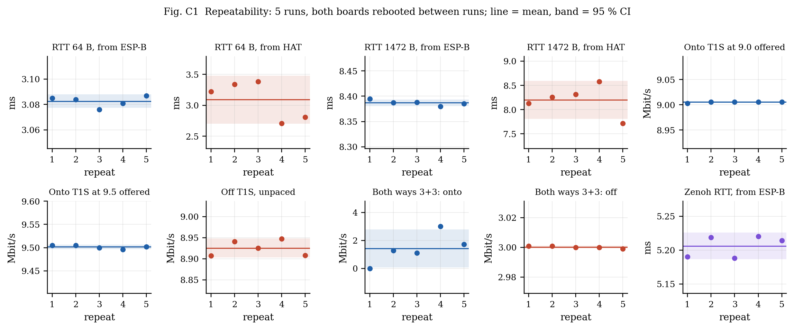
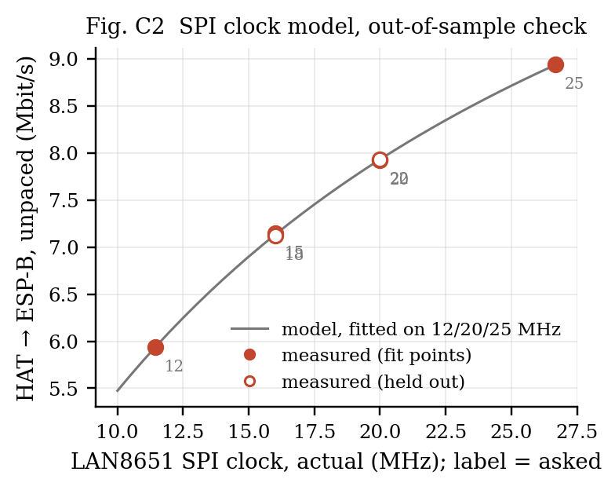
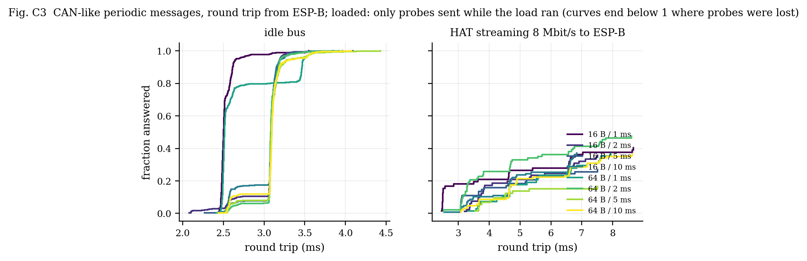
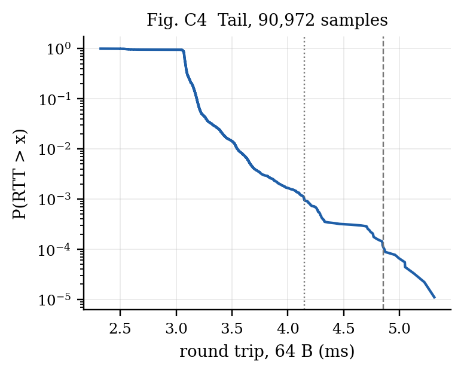
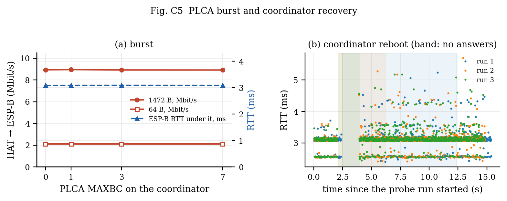

# Two-board T1S campaign: repeatability, SPI model check, periodic traffic, tail, recovery

*Run 2026-10-06 10:13:59 — `campaign_20261006_101359.json`, generated by `make_campaign_report.py`. Intervals are 95 % (Student t over the repeats).*

**Setup.** esp32-5: ESP32-S3 + LAN8651 HAT, PLCA on (id 0 of 2), SPI 25 MHz, 192.168.100.65. esp32-7: ESP32-S3 W5500 at 192.168.100.66 on the converter's 100BASE-TX port. Converter: LAN8670 + LAN9355, ID 1 / count 0 (not coordinating). All traffic generated and measured by the two boards; Zenoh's periodic traffic paused except in its own measurements.

## 1. Repeatability (5 runs, both boards rebooted between runs)

| metric | per run | mean ± 95 % CI | spread (max−min) |
|---|---|---|---|
| RTT 64 B, from ESP-B | 3.085 / 3.084 / 3.076 / 3.081 / 3.087 | **3.083 ± 0.005 ms** | 0.011 |
| RTT 64 B, from HAT | 3.223 / 3.339 / 3.385 / 2.706 / 2.808 | **3.092 ± 0.389 ms** | 0.679 |
| RTT 1472 B, from ESP-B | 8.395 / 8.387 / 8.388 / 8.380 / 8.386 | **8.387 ± 0.007 ms** | 0.015 |
| RTT 1472 B, from HAT | 8.134 / 8.262 / 8.318 / 8.579 / 7.714 | **8.201 ± 0.394 ms** | 0.865 |
| Onto T1S at 9.0 offered | 9.003 / 9.006 / 9.006 / 9.006 / 9.006 | **9.005 ± 0.002 Mbit/s** | 0.003 |
| Onto T1S at 9.5 offered | 9.505 / 9.505 / 9.500 / 9.496 / 9.502 | **9.502 ± 0.005 Mbit/s** | 0.009 |
| Off T1S, unpaced | 8.907 / 8.941 / 8.925 / 8.947 / 8.908 | **8.926 ± 0.023 Mbit/s** | 0.040 |
| Both ways 3+3: onto | 0.000 / 1.285 / 1.094 / 3.001 / 1.725 | **1.421 ± 1.351 Mbit/s** | 3.001 |
| Both ways 3+3: off | 3.001 / 3.001 / 3.000 / 3.000 / 2.999 | **3.000 ± 0.001 Mbit/s** | 0.002 |
| Zenoh RTT, from ESP-B | 5.190 / 5.218 / 5.188 / 5.220 / 5.214 | **5.206 ± 0.020 ms** | 0.032 |

**Stable across reboots** (95 % CI under 1 % of the mean): RTT 64 B, from ESP-B, RTT 1472 B, from ESP-B, Onto T1S at 9.0 offered, Onto T1S at 9.5 offered, Off T1S, unpaced, Both ways 3+3: off, Zenoh RTT, from ESP-B.

- **RTT 64 B, from HAT** moves between runs (2.71–3.38 ms) while staying tight within a run. The HAT's probe timer and ESP-B's 1 ms W5500 poll start at an arbitrary phase after each boot, and the reply waits for that poll: a reboot reshuffles the phase. Seen from ESP-B, which owns the poll, the same path is stable.
- **RTT 1472 B, from HAT** moves between runs (7.71–8.58 ms) while staying tight within a run. The HAT's probe timer and ESP-B's 1 ms W5500 poll start at an arbitrary phase after each boot, and the reply waits for that poll: a reboot reshuffles the phase. Seen from ESP-B, which owns the poll, the same path is stable.
- **Both ways 3+3: onto**: the converter's stream onto T1S fell short of the 3 Mbit/s offered in **4 of 5 runs** (0.00 / 1.28 / 1.09 / 3.00 / 1.73 Mbit/s), from a total stall to none. The collapse is real but not deterministic; a single run can show anything from 0 to 3 Mbit/s, which is why repeats were needed to state it.

## 2. SPI clock: model fitted on 12/20/25 MHz, checked on 15/18/22 MHz

Model: every 1472 B datagram costs a fixed **t0 = 842 µs** plus **k/f = 13711 µs·MHz / f** of SPI time, fitted on the fit clocks only. With 24 TC6 chunks of 68 B per frame, k corresponds to **c = 1.05** clock periods per transferred bit (1.00 would be the bare chunk transfer).

| SPI MHz asked → actual | role | measured (Mbit/s) | model (Mbit/s) | error | 512 B unpaced | onto T1S at 9.5 | RTT 1472 B from HAT (ms) |
|---|---|---|---|---|---|---|---|
| 12 → 11.43 | fit | 5.935 | 5.934 | +0.0 % | 4.804 | 6.506 | 9.65 |
| 15 → 16.00 | held out | 7.147 | 7.131 | +0.2 % | 5.559 | 7.912 | 9.24 |
| 18 → 16.00 | held out | 7.124 | 7.131 | -0.1 % | 5.570 | 7.930 | 8.52 |
| 20 → 20.00 | fit | 7.923 | 7.931 | -0.1 % | 6.052 | 8.897 | 8.24 |
| 22 → 20.00 | held out | 7.927 | 7.931 | -0.1 % | 6.039 | 8.886 | 8.61 |
| 25 → 26.67 | fit | 8.942 | 8.934 | +0.1 % | 6.615 | 9.499 | 7.76 |

Held-out error: mean **0.1 %**, worst **0.2 %**.

**The clock asked for is not the clock that runs.** The ESP32-S3's SPI peripheral divides 80 MHz by an integer, so the boards ran: 12 → 11.43, 15 → 16.00, 18 → 16.00, 20 → 20.00, 22 → 20.00, 25 → 26.67. The "25 MHz" of every earlier report is **26.67 MHz**. The held-out settings therefore land on one new clock (16 MHz, asked as 15 and 18) and on a fit clock again (20 MHz, asked as 22), which checks repeatability rather than prediction; the model is fitted and drawn against the actual clock.

## 3. CAN-like periodic messages

Sequential probes (one in flight), so the effective period is max(period, round trip). Under load only the probes sent while the load was running are counted (each probe's start time is rebuilt from the intervals, answers and 100 ms timeouts). Deadline columns count a probe as missed if it was lost or its round trip exceeded the deadline. Bound: the idle median plus one worst-case wait behind a 1518 B frame in each direction (2 × 1.239 ms).

| payload | period | load | probes | lost | median | p99 | max | > idle + 2×wait | miss @ 5 ms | miss @ 10 ms |
|---|---|---|---|---|---|---|---|---|---|---|
| 16 B | 1 ms | idle | 500 | 0 | 2.50 | 3.44 | 3.55 | 0 | 0.0 % | 0.0 % |
| 16 B | 2 ms | idle | 500 | 0 | 3.08 | 3.30 | 4.09 | 0 | 0.0 % | 0.0 % |
| 16 B | 5 ms | idle | 500 | 0 | 3.09 | 3.38 | 3.96 | 0 | 0.0 % | 0.0 % |
| 16 B | 10 ms | idle | 500 | 0 | 3.09 | 3.36 | 3.84 | 0 | 0.0 % | 0.0 % |
| 64 B | 1 ms | idle | 500 | 0 | 2.51 | 3.61 | 3.85 | 0 | 0.0 % | 0.0 % |
| 64 B | 2 ms | idle | 500 | 0 | 3.08 | 3.48 | 3.92 | 0 | 0.0 % | 0.0 % |
| 64 B | 5 ms | idle | 500 | 0 | 3.09 | 3.67 | 4.43 | 0 | 0.0 % | 0.0 % |
| 64 B | 10 ms | idle | 500 | 0 | 3.09 | 3.61 | 4.07 | 0 | 0.0 % | 0.0 % |
| 16 B | 1 ms | 8 Mbit/s | 72 | 43 | 3.63 | 8.66 | 8.67 | 10 | 73.6 % | 59.7 % |
| 16 B | 2 ms | 8 Mbit/s | 81 | 52 | 4.10 | 7.50 | 7.52 | 10 | 79.0 % | 64.2 % |
| 16 B | 5 ms | 8 Mbit/s | 82 | 60 | 3.71 | 7.36 | 7.51 | 3 | 81.7 % | 73.2 % |
| 16 B | 10 ms | 8 Mbit/s | 127 | 80 | 4.67 | 6.80 | 6.84 | 15 | 76.4 % | 63.0 % |
| 64 B | 1 ms | 8 Mbit/s | 68 | 43 | 5.23 | 7.86 | 7.94 | 13 | 82.4 % | 63.2 % |
| 64 B | 2 ms | 8 Mbit/s | 97 | 51 | 3.80 | 8.24 | 8.62 | 13 | 67.0 % | 52.6 % |
| 64 B | 5 ms | 8 Mbit/s | 73 | 61 | 4.10 | 7.26 | 7.51 | 1 | 86.3 % | 83.6 % |
| 64 B | 10 ms | 8 Mbit/s | 126 | 80 | 4.87 | 8.63 | 8.64 | 18 | 78.6 % | 63.5 % |

On an idle bus every probe returns, well inside a 5 ms deadline, and none exceeds the bound. Under an 8 Mbit/s stream from the node, **53–84 % of the probes sent during the load are lost**, and most of those that return still sit near the idle median. The losses are the converter's: each probe has to go onto T1S through it while the node streams the other way (§1, two-way). The answered probes that exceed the bound do so by queueing behind the node's own stream in its transmit path, not on the wire.

## 4. Tail (90,972 probes, 64 B every 2 ms, 15 min)

| median | p99 | p99.9 | p99.99 | max | lost |
|---|---|---|---|---|---|
| 3.083 | 3.548 | 4.146 | 4.853 | 5.311 | 3 |

## 5. PLCA burst and coordinator recovery

| MAXBC | register read back | 1472 B unpaced (Mbit/s) | 64 B unpaced (Mbit/s) | ESP-B probes during the coordinator's 8 s flood: answered |
|---|---|---|---|---|
| 0 | `0x00000080` | 8.926 | 2.106 | 12 of 84 |
| 1 | `0x00000180` | 8.946 | 2.109 | 10 of 82 |
| 3 | `0x00000380` | 8.913 | 2.108 | 10 of 82 |
| 7 | `0x00000780` | 8.908 | 2.105 | 10 of 82 |

While the coordinator floods unpaced, **only 12–14 % of the other node's probes are answered** at any MAXBC: they have to get onto T1S through the converter while the bus is busy in the other direction. They are all answered again once the flood ends.

Burst mode changes nothing measurable: with lwIP handing the MAC one frame per call over SPI, the coordinator rarely has a second frame ready inside the burst timer, so it never uses the extra slots.

| run | probes | lost | longest run of lost probes | outage |
|---|---|---|---|---|
| 1 | 1025 | 20 | 17 | **1.87 s** (± 0.11) |
| 2 | 1000 | 18 | 17 | **1.87 s** (± 0.11) |
| 3 | 1000 | 17 | 17 | **1.87 s** (± 0.11) |

Outage = the longest run of unanswered probes × (10 ms interval + 100 ms timeout), so ± one probe. Mean 1.87 s over 3 reboots.

The outage covers the coordinator's own reboot and bring-up (ESP32 boot, LAN8651 driver install, PLCA). Answers resume as soon as its first beacon goes out; the peer and the converter need no recovery action.

## 6. What two boards cannot show (stated, not hidden)

| reviewer item | why not here | what it needs |
|---|---|---|
| more than 2 PLCA nodes (cycle vs N, fairness, empty slots) | one LAN8651 node exists | a second / third LAN8651 node (HAT Rev C) |
| converter removed (control experiment) | the only other T1S device is the converter | two LAN8651 nodes, or node + bridge pair |
| baseline without T1S | W5500 ⇄ W5500 needs a crossover (no auto-MDIX, datasheet) | a crossover cable or a switch |
| cable length / stubs / termination | one 1 m cable | cables and a multidrop harness |
| TO_TIMER sweep | the converter's TO cannot be set; mismatched TO would measure the mismatch | two settable nodes |
| collision / error counters | the guessed MAC counter map was wrong and stalled TX | the LAN8651 statistics register map |
| CPU load and power | not instrumented | FreeRTOS run-time stats build, a power meter |
| Zenoh ~1000 msg/s receive cap | cause inside zenoh-pico, not found | profiling of zenoh-pico's executor |

- TO_TIMER not swept: the converter's TO cannot be set (its UART is output-only); a TO differing between nodes desynchronises PLCA, which would measure the mismatch, not TO.
- SPI clock: the peripheral runs 80 MHz / integer; actual clocks read from the board after the run (same firmware path, deterministic): {'12': 11.43, '15': 16.0, '18': 16.0, '20': 20.0, '22': 20.0, '25': 26.67}

**Measurement corrections in this run:** the sink's rate is now (all datagrams after the first) / (first-to-last arrival, µs), removing the ~0.5 % over-read; arrival-gap histogram extended to 50 ms (20 µs bins to 2 ms, 1 ms bins above).

