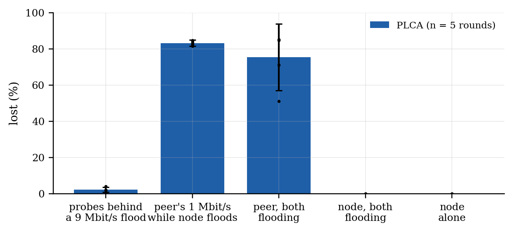
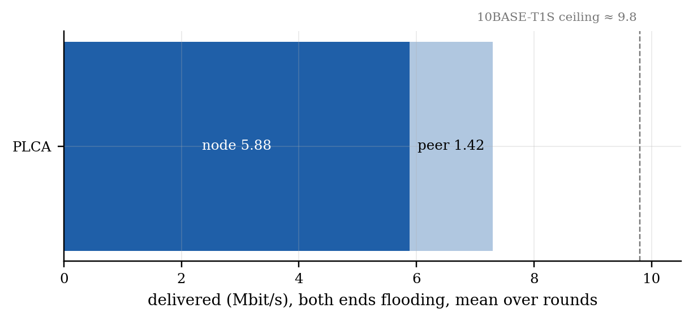

# PLCA vs CSMA/CD on one 10BASE-T1S segment, repeated

*Generated by `make_access_report.py` from `access_20261006_114158.json`.*

**Bench.** ESP-A: ESP32-S3 + LAN8651 MAC-PHY, PLCA coordinator (id 0 of 2), SPI 20.00 MHz. Converter: LAN8670 + LAN9355, dial id 1. ESP-B: ESP32-S3 + W5500 on the converter's 100BASE-TX port, in the PC's place. 1000 B UDP. The same five phases as the 2026-10-01 PC comparison; every number below is per round, mean ± 95 % CI (Student t) over rounds.

> **CSMA/CD rounds pending.** The converter's PLCA is a DIP switch. With it on and only the node switched to `csma`, the converter does not fall back to CSMA/CD: it stops transmitting (every probe and every flood datagram from ESP-B lost, `access_20261006_113637`). The CSMA/CD rounds need DIP 1 off by hand; this report fills its second column when they exist.

*Fig. A1 — Loss in each phase, per method; bars are means, whiskers 95 % CI, dots single rounds.*

*Fig. A2 — How the bus is shared when both ends flood: the node's delivered rate (solid) and the peer's (light).*

| phase | metric | PLCA (n = 5) |
|---|---|---|
| idle | 64 B round trip, median (from ESP-B) | 2.59 ± 0.01 ms <small>(2.58–2.60)</small> |
| idle | probes lost | 0.0 ± 0.0 % <small>(0.0–0.0)</small> |
| peer floods 9 Mbit/s | node's probes lost | 2.2 ± 1.4 % <small>(1.0–4.0)</small> |
| peer floods 9 Mbit/s | node's probe round trip, median | 3.04 ± 0.19 ms <small>(2.86–3.23)</small> |
| peer floods 9 Mbit/s | node's probe round trip, p99 | 1730.18 ± 1041.21 ms <small>(821.54–2639.82)</small> |
| peer floods 9 Mbit/s | flood delivered to the node | 8.52 ± 0.02 Mbit/s <small>(8.51–8.54)</small> |
| peer floods 9 Mbit/s | flood lost | 5.3 ± 0.2 % <small>(5.1–5.5)</small> |
| node floods, peer 1 Mbit/s | node -> peer delivered | 7.05 ± 0.01 Mbit/s <small>(7.04–7.06)</small> |
| node floods, peer 1 Mbit/s | node -> peer lost | 0.00 ± 0.00 % <small>(0.00–0.00)</small> |
| node floods, peer 1 Mbit/s | peer -> node delivered (of 1.0) | 0.17 ± 0.02 Mbit/s <small>(0.15–0.18)</small> |
| node floods, peer 1 Mbit/s | peer -> node lost | 83.2 ± 1.7 % <small>(81.4–84.6)</small> |
| both flood | node -> peer delivered | 5.88 ± 1.10 Mbit/s <small>(4.49–6.48)</small> |
| both flood | node -> peer lost | 0.00 ± 0.00 % <small>(0.00–0.00)</small> |
| both flood | node's longest gap | 527 ± 977 ms <small>(7–1782)</small> |
| both flood | peer -> node delivered | 1.42 ± 1.30 Mbit/s <small>(0.73–3.13)</small> |
| both flood | peer -> node lost | 75.4 ± 18.4 % <small>(51.0–85.1)</small> |
| node alone | node -> peer delivered | 7.22 ± 0.01 Mbit/s <small>(7.22–7.23)</small> |
| node alone | node -> peer lost | 0.00 ± 0.00 % <small>(0.00–0.00)</small> |
| node alone | arrival gap p99 | 2.50 ± 0.00 ms <small>(2.50–2.50)</small> |

**Reading it (PLCA).** The node never lost a datagram it sent: 0.00 % while it flooded alone, 0.00 % with the peer sending, 0.00 % with both flooding. Its small probes got onto a bus the peer was flooding at 9 Mbit/s with 2.2 % loss (median 3.04 ms), but their tail is in seconds (p99 1.73 s): the peer offers 9 Mbit/s and the converter carries 8.52 onto T1S, so a queue builds on that path and the replies wait behind it — the median hides it. What PLCA does not protect is the converter's own stream: while the node floods, 83 % of the peer's 1 Mbit/s is lost, and with both flooding 75 % — the converter's two-way limitation the vendor lists (issue 4.3), seen in every round. When both flood, the node keeps 5.88 Mbit/s but stalls for up to 527 ms (mean of per-round maxima): it waits for transmit opportunities rather than losing frames.

**Limits.** Two nodes on the bus, one of them a converter whose transmit path is the known weak point; rounds of one method run back to back (the DIP is set by hand), so slow drift between the two blocks is not randomised out; one bus length (~1 m).
