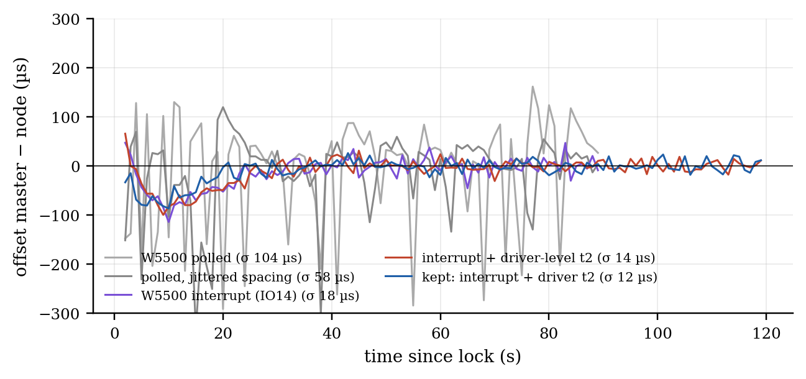
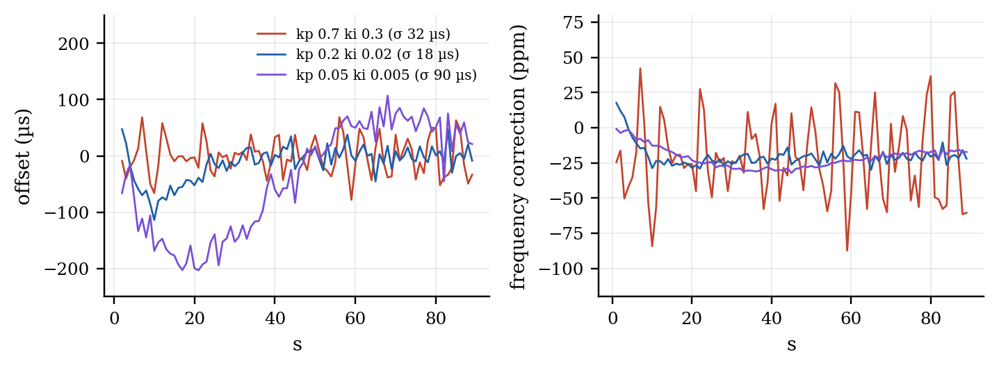

# Time synchronisation over 10BASE-T1S: software stamps, LAN8651 hardware stamps, a PI clock servo

*Generated by `make_ptp_report.py` from the console logs in `docs/t1s_results/sync`. Bench: ESP32-S3 + LAN8651 HAT (node, PLCA coordinator, SPI 20 MHz) ═T1S═ media converter ─100BASE-TX─ ESP32-S3 + W5500 (ESP-B). 2026-10-06.*

## 1. Measuring: two-way time transfer

ESP-B asks, the node answers (UDP 5007): t1..t4, offset = ((t2 − t1) + (t3 − t4)) / 2. Precision is the scatter of the offset around its drift line; with no reference clock on the bench, accuracy is not measured.

| stamps | exchanges | σ, all | σ, min-delay per 2 s | drift |
|---|---|---|---|---|
| software, both boards | 998 | 147 µs | 53 µs | -1.7 ppm |
| node hardware, ESP-B software | 876 | 169 µs | 15 µs | +19.8 ppm |

The node's hardware stamps come from the LAN8651's 1588 wall clock (TSU, 40 ns per 25 MHz tick). Two settings had to be found: OA_CONFIG0.FTSE/FTSS take effect only when written with SYNC at init, and the PHY's packet matcher, which triggers the stamp at the SFD on the wire, is off out of reset (STATUS1.TTSCMA: capture requested, not triggered). The drift differs between the rows because the hardware clock runs off the HAT's crystal, the software one off the ESP32's.

## 2. Steering: a PI servo on the LAN8651 clock (`ptp lock`)

The node asks ESP-B 16 times a second (its request and the reply stamped in hardware), keeps the min-delay exchange per second, steps once (TA register below 1 s, else TSL/TN) and then steers the TSU frequency (TI + TISUBN, 2⁻²⁴ ns steps). Offset after the first 20 s:

| run | master side | kp / ki | σ | max | mean | one-way delay p50 | frequency held |
|---|---|---|---|---|---|---|---|
| `lock_0.7_0.3` | W5500 polled | 0.7 / 0.3 | **233.7 µs** | 595 µs | -0.2 µs | 802 µs | -15.7 ± 157.7 ppm |
| `lock_0.2_0.02` | W5500 polled | 0.2 / 0.02 | **104.3 µs** | 291 µs | -4.5 µs | 1019 µs | -21.7 ± 21.9 ppm |
| `lock_0.05_0.005` | W5500 polled | 0.05 / 0.005 | **116.8 µs** | 282 µs | -49.4 µs | 970 µs | -24.8 ± 5.9 ppm |
| `lock1` | W5500 polled (first run) | 0.7 / 0.3 | **38.1 µs** | 90 µs | +0.1 µs | 750 µs | -20.3 ± 33.7 ppm |
| `lock2s_0.4_0.08` | + post-send t3 (reverted) | 0.4 / 0.08 | **38.3 µs** | 240 µs | +0.3 µs | 197 µs | -20.9 ± 17.4 ppm |
| `lock2s_0.2_0.02` | + post-send t3 (reverted) | 0.2 / 0.02 | **23.1 µs** | 78 µs | -2.0 µs | 193 µs | -21.3 ± 4.8 ppm |
| `lockdrv_0.4_0.08` | interrupt + driver-level t2 | 0.4 / 0.08 | **14.6 µs** | 37 µs | -0.2 µs | 533 µs | -21.0 ± 6.6 ppm |
| `lockdrv_0.2_0.02` | interrupt + driver-level t2 | 0.2 / 0.02 | **13.9 µs** | 49 µs | -1.8 µs | 532 µs | -21.4 ± 2.7 ppm |
| `lockfinal_0` | kept: interrupt + driver t2 | 0.2 / 0.02 | **14.9 µs** | 48 µs | -1.0 µs | 520 µs | -21.0 ± 3.1 ppm |
| `lockfinal_1` | kept: interrupt + driver t2 | 0.2 / 0.02 | **11.6 µs** | 28 µs | -0.3 µs | 519 µs | -20.8 ± 2.5 ppm |
| `lockint_0.7_0.3` | W5500 interrupt (IO14) | 0.7 / 0.3 | **32.2 µs** | 78 µs | -0.7 µs | 740 µs | -21.3 ± 28.5 ppm |
| `lockint_0.2_0.02` | W5500 interrupt (IO14) | 0.2 / 0.02 | **18.5 µs** | 52 µs | -2.3 µs | 736 µs | -21.4 ± 3.7 ppm |
| `lockint_0.05_0.005` | W5500 interrupt (IO14) | 0.05 / 0.005 | **89.8 µs** | 203 µs | -17.4 µs | 741 µs | -24.0 ± 4.9 ppm |
| `lockj_0.7_0.3` | polled, jittered spacing | 0.7 / 0.3 | **200.7 µs** | 436 µs | +2.4 µs | 851 µs | -15.1 ± 134.8 ppm |
| `lockj_0.2_0.02` | polled, jittered spacing | 0.2 / 0.02 | **58.1 µs** | 301 µs | +3.7 µs | 1005 µs | -19.9 ± 12.3 ppm |
| `lockj_0.05_0.005` | polled, jittered spacing | 0.05 / 0.005 | **94.4 µs** | 190 µs | -19.7 µs | 951 µs | -25.2 ± 4.9 ppm |

**Reading it.** The servo locks within 2 s and holds about −21 ppm, the HAT crystal against the ESP32's. What limits the result is the master's side, step by step: (1) ESP-B's W5500 was polled every 1 ms, so its receive time wandered by up to 1 ms -- the Elite wires the W5500's INTn to IO14, and interrupt-driven receive halves the scatter; (2) ESP-B stamped t2 in the UDP socket task -- a tap in the Ethernet driver's receive path, before lwIP, takes another quarter off; (3) a t3 taken after the send returned (a software two-step) scattered more than one taken just before it and was reverted. A request spacing of whole milliseconds kept every request at the same poll phase, so the spacing is jittered by 0–1 ms. ptp4l's gains (0.7 / 0.3) turn this bench's measurement noise into ±30–40 ppm frequency swings; 0.2 / 0.02 is the default.

## 3. Limits

- One side only has hardware stamps; the master is software (ESP-B) and the path crosses a store-and-forward converter whose queueing is not symmetric. Two LAN8651 nodes (hardware at both ends, no converter) are the next measurement; the servo already uses a master's hardware follow-up when it gets one.
- No reference: offsets are precision, not accuracy. A PPS on DIOA0 from each node and an oscilloscope would give accuracy directly (the firmware has `ptp pps`; Rev C ties DIOA to ground).
- Timestamps on every received frame cost 6 % of receive throughput (8.75 → 8.20 Mbit/s at 1472 B), so they are a build option (`-DLAN865X_FRAME_TIMESTAMPS`).
