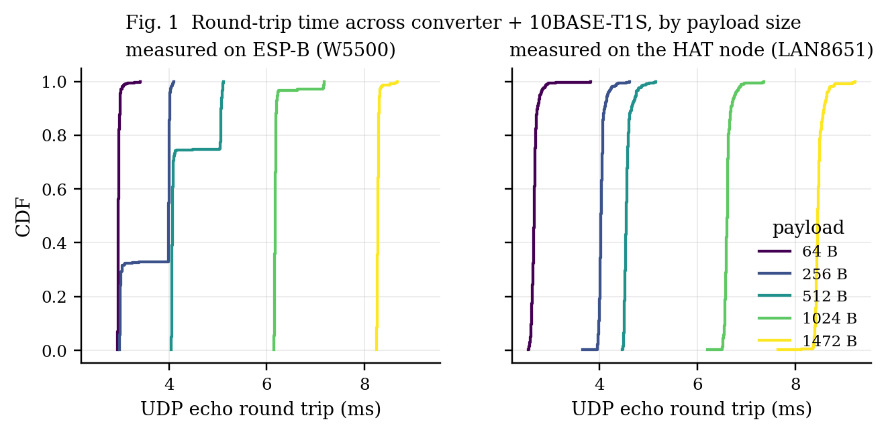
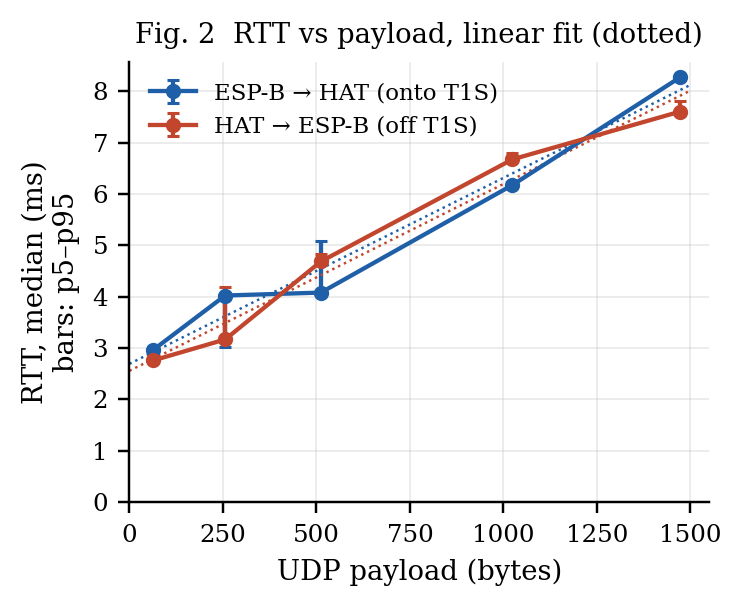
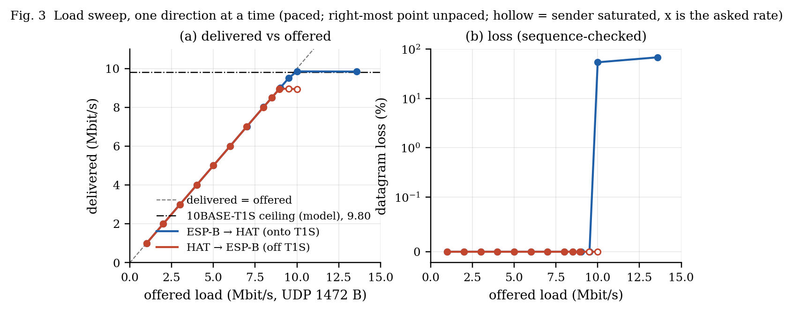
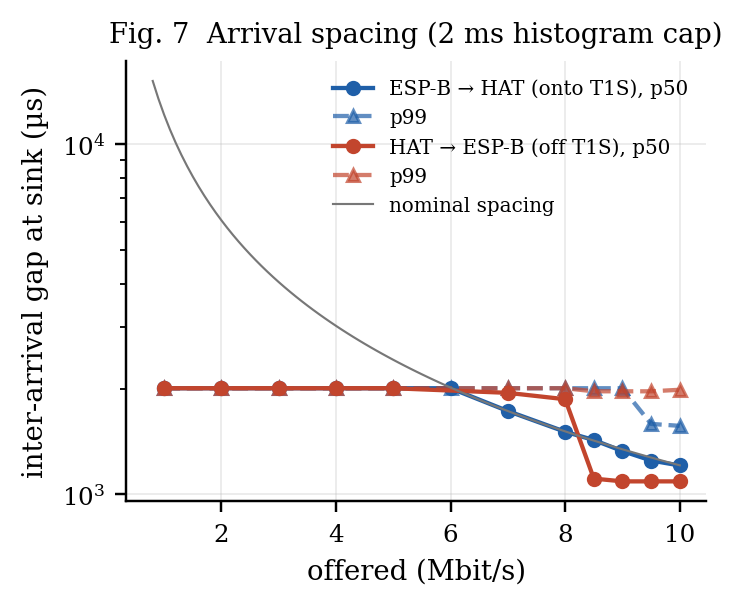
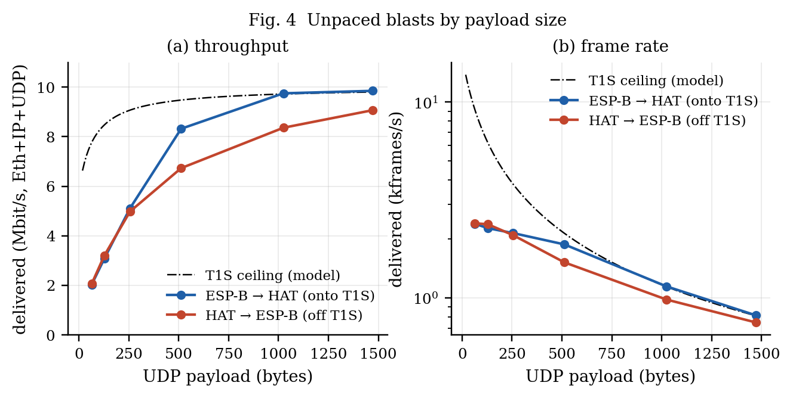
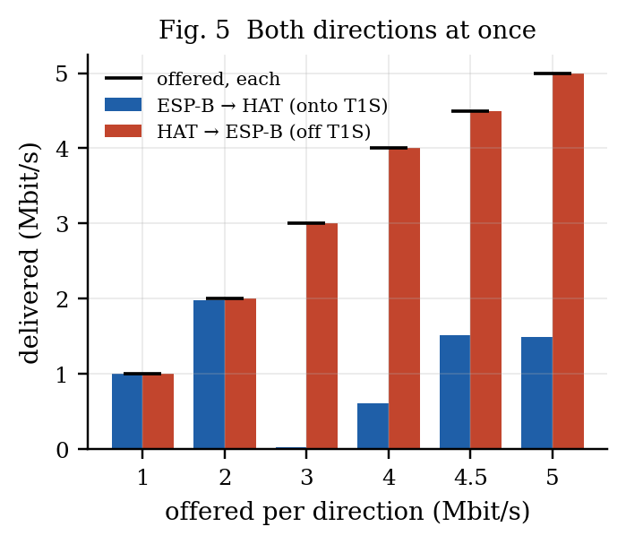
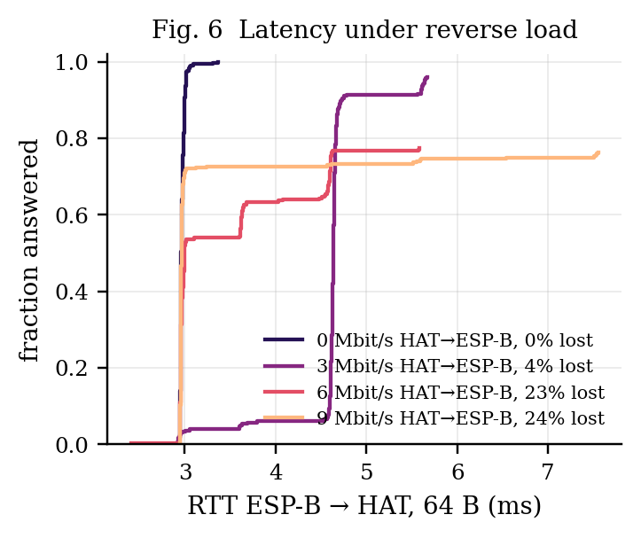
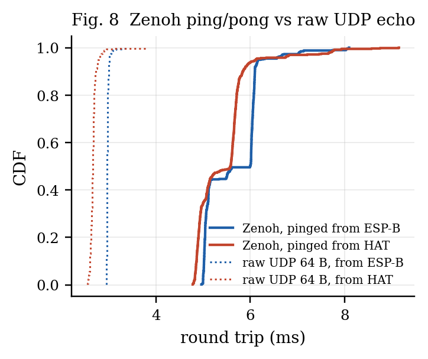
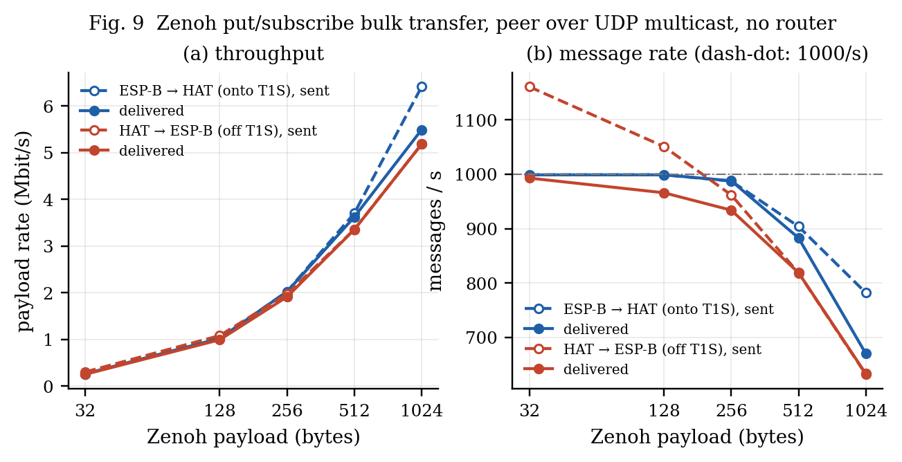

# 10BASE-T1S through a media converter, measured end to end by two ESP32-S3 boards

*Run 2026-10-02 15:57:42 — generated by `make_duo_report.py` from `duo_suite_20261002_160735.json`.*

## Abstract

A LAN8651 MAC-PHY node on an ESP32-S3 and a second ESP32-S3 on 100BASE-TX exchanged UDP through a 100BASE-TX/10BASE-T1S converter, with no PC in the data path. Both boards ran the same firmware and measured each other. One direction at a time, the bus carried **9.51 Mbit/s onto T1S and 8.96 Mbit/s off it with no datagram lost** (sequence-checked), 97 % and 91 % of the 9.80 Mbit/s the 10BASE-T1S frame model allows. A 64-byte UDP round trip took **2.97 ms median** (p99 3.09 ms); 1472 bytes took 8.27 ms. Over 60 s at 8 Mbit/s each way, 3 of 39631 (tx->node) and 0 of 39607 (node->tx) datagrams were lost. With both directions loaded at once, the node's stream arrived whole while the converter's own stream lost most of its datagrams — the converter, not the bus, is the bottleneck there. Zenoh ran on the same two boards **peer to peer over UDP multicast, with no router**: a pub/sub round trip took 5.6–6.0 ms median in either direction, and bulk puts delivered up to 5.5 Mbit/s of payload.

## 1. Setup

```
ESP-A: ESP32-S3 + LAN8651 HAT        converter               ESP-B: ESP32-S3 + W5500
SPI 25  MHz, PLCA 0 of 2 (coord.)      LAN8670 + LAN9355       W5500 SPI 40 MHz, polled 1 ms
192.168.100.65   ══ 10BASE-T1S ══  [T1S | TX]  ── 100BASE-TX ──  192.168.100.66
```

| | |
|---|---|
| node | LAN8651 rev 2, firmware `t1s_node` mode node, UDP echo on port 7, sink on port 9 |
| peer | W5500 (polled every 1 ms by the IDF driver), `t1s_node` mode tx, same echo and sink |
| converter | 3-port 10BASE-T1S / 100BASE-T1 / 100BASE-TX media converter (LAN8670 PHY, LAN9355 switch); dials ID 1, count 0, so the HAT is the PLCA coordinator |
| traffic | `blast`: UDP with a 32-bit sequence number in the first 4 bytes, optionally paced to a target rate; `sink`: counts, checks sequence (loss, reordering, duplicates) and histograms inter-arrival gaps (20 µs bins) |
| latency | `rtt`: UDP echo, one datagram in flight, timed with `esp_timer` (1 µs), 3 ms between probes, 100 ms timeout |
| rate accounting | Mbit/s counts UDP payload + 42 B of Ethernet/IP/UDP headers per datagram, as both tools report |

**T1S model.** Each datagram of L payload bytes occupies (L + 42 + 4 FCS + 8 preamble + 12 IFG) bytes on the wire, plus about 52 bit times of PLCA overhead per frame (the idle node's 32-bit transmit opportunity and a share of the BEACON, burst mode off). At 1472 B this gives a ceiling of **9.80 Mbit/s** in the accounting above.

## 2. Results

### 2.1 Round-trip time



| direction | payload | n | lost | min | median | p99 | max | σ |
|---|---|---|---|---|---|---|---|---|
| ESP-B → HAT (onto T1S) | 64 B | 400 | 0 | 2.95 | **2.97** | 3.09 | 3.41 | 0.035 |
| ESP-B → HAT (onto T1S) | 256 B | 400 | 0 | 2.98 | **4.00** | 4.07 | 4.10 | 0.468 |
| ESP-B → HAT (onto T1S) | 512 B | 400 | 0 | 4.04 | **4.07** | 5.10 | 5.11 | 0.435 |
| ESP-B → HAT (onto T1S) | 1024 B | 400 | 0 | 6.14 | **6.17** | 7.17 | 7.18 | 0.166 |
| ESP-B → HAT (onto T1S) | 1472 B | 400 | 0 | 8.24 | **8.27** | 8.52 | 8.67 | 0.040 |
| HAT → ESP-B (off T1S) | 64 B | 400 | 0 | 2.55 | **2.66** | 2.90 | 3.81 | 0.085 |
| HAT → ESP-B (off T1S) | 256 B | 400 | 0 | 3.66 | **4.03** | 4.33 | 4.61 | 0.073 |
| HAT → ESP-B (off T1S) | 512 B | 400 | 0 | 4.46 | **4.54** | 4.94 | 5.14 | 0.086 |
| HAT → ESP-B (off T1S) | 1024 B | 400 | 0 | 6.21 | **6.61** | 6.90 | 7.35 | 0.087 |
| HAT → ESP-B (off T1S) | 1472 B | 400 | 0 | 7.64 | **8.46** | 8.79 | 9.22 | 0.106 |

All times in ms.



- ESP-B → HAT (onto T1S): RTT ≈ 2.68 ms + 3.63 µs × payload bytes.
- HAT → ESP-B (off T1S): RTT ≈ 2.64 ms + 3.93 µs × payload bytes.

**Millisecond steps.** Seen from ESP-B, round trips cluster at whole milliseconds: 99 % of the 64 B samples lie within 0.1 ms of an integer number of ms, and larger payloads jump from one step to the next (Fig. 1, left). That is the W5500 driver's 1 ms receive poll: a reply that reaches the chip waits for the next poll tick. Seen from the HAT, whose LAN8651 interrupts on receive, the same paths spread continuously (Fig. 1, right).

**Reading it.** Every payload byte crosses each link twice per round trip. Serialisation alone predicts 10BASE-T1S (0.8 µs/B) → 1.60, 100BASE-TX (0.08 µs/B) → 0.16, LAN8651 SPI 26.67 MHz actual (0.30 µs/B) → 0.60, W5500 SPI 40 MHz (0.2 µs/B) → 0.40 µs, **2.76 µs/B in total; the fit gives 3.78 µs/B.** The remaining 1.02 µs/B is per-byte work in software (copies through lwIP and both drivers). The intercept (≈2.7 ms) is fixed per-packet cost: the W5500 driver's 1 ms receive poll on ESP-B, lwIP and echo-task turnarounds, and PLCA transmit opportunities. The PC-based run of 2026-10-01 had no polling on its side and measured 0.85 ms for 64 B.

### 2.2 Throughput, one direction at a time



| direction | offered | delivered | sent | received | loss | reordered | gap p50 / p99 (µs) |
|---|---|---|---|---|---|---|---|
| ESP-B → HAT (onto T1S) | 1.00 | 1.00 | 332 | 332 | 0.00 % | 0 | 2010 / 2010 |
| ESP-B → HAT (onto T1S) | 2.00 | 2.00 | 662 | 662 | 0.00 % | 0 | 2010 / 2010 |
| ESP-B → HAT (onto T1S) | 3.00 | 3.00 | 992 | 992 | 0.00 % | 0 | 2010 / 2010 |
| ESP-B → HAT (onto T1S) | 4.00 | 4.00 | 1322 | 1322 | 0.00 % | 0 | 2010 / 2010 |
| ESP-B → HAT (onto T1S) | 5.00 | 5.00 | 1652 | 1652 | 0.00 % | 0 | 2010 / 2010 |
| ESP-B → HAT (onto T1S) | 6.00 | 6.00 | 1983 | 1983 | 0.00 % | 0 | 2010 / 2010 |
| ESP-B → HAT (onto T1S) | 7.00 | 7.01 | 2313 | 2313 | 0.00 % | 0 | 1730 / 2010 |
| ESP-B → HAT (onto T1S) | 8.00 | 8.01 | 2643 | 2643 | 0.00 % | 0 | 1510 / 2010 |
| ESP-B → HAT (onto T1S) | 8.51 | 8.51 | 2809 | 2809 | 0.00 % | 0 | 1410 / 2010 |
| ESP-B → HAT (onto T1S) | 9.01 | 9.01 | 2974 | 2974 | 0.00 % | 0 | 1330 / 2010 |
| ESP-B → HAT (onto T1S) | 9.51 | 9.51 | 3140 | 3140 | 0.00 % | 0 | 1250 / 2010 |
| ESP-B → HAT (onto T1S) | 10.00 | 9.85 | 3303 | 1523 | 53.89 % | 0 | 1210 / 1610 |
| ESP-B → HAT (onto T1S) | 13.58 | 9.84 | 4484 | 1437 | 67.95 % | 0 | 1210 / 1670 |
| HAT → ESP-B (off T1S) | 1.00 | 1.00 | 332 | 332 | 0.00 % | 0 | 2010 / 2010 |
| HAT → ESP-B (off T1S) | 2.00 | 2.00 | 662 | 662 | 0.00 % | 0 | 2010 / 2010 |
| HAT → ESP-B (off T1S) | 3.00 | 3.00 | 992 | 992 | 0.00 % | 0 | 2010 / 2010 |
| HAT → ESP-B (off T1S) | 4.00 | 4.00 | 1322 | 1322 | 0.00 % | 0 | 2010 / 2010 |
| HAT → ESP-B (off T1S) | 5.00 | 5.00 | 1652 | 1652 | 0.00 % | 0 | 2010 / 2010 |
| HAT → ESP-B (off T1S) | 6.00 | 6.00 | 1982 | 1982 | 0.00 % | 0 | 2010 / 2010 |
| HAT → ESP-B (off T1S) | 6.99 | 7.00 | 2310 | 2310 | 0.00 % | 0 | 1950 / 2010 |
| HAT → ESP-B (off T1S) | 7.99 | 8.00 | 2640 | 2640 | 0.00 % | 0 | 1850 / 2010 |
| HAT → ESP-B (off T1S) | 8.50 | 8.50 | 2807 | 2807 | 0.00 % | 0 | 1110 / 2010 |
| HAT → ESP-B (off T1S) | 8.94 | 8.94 | 2952 | 2952 | 0.00 % | 0 | 1070 / 2010 |
| HAT → ESP-B (off T1S) | 9.5 | 8.95 | 2954 | 2954 | 0.00 % | 0 | 1090 / 2010 |
| HAT → ESP-B (off T1S) | 10 | 8.94 | 2952 | 2952 | 0.00 % | 0 | 1090 / 2010 |
| HAT → ESP-B (off T1S) | 8.95 | 8.96 | 2956 | 2956 | 0.00 % | 0 | 1090 / 2010 |

**Overload stalls the stream.** In 2 row(s) the receiver's window is shorter than the blast: ESP-B → HAT (onto T1S) at 10.00 Mbit/s: 1.9 of 4.0 s, seq gaps 22; ESP-B → HAT (onto T1S) at 13.58 Mbit/s: 1.8 of 4.0 s, seq gaps 539. Delivery ran at the bus ceiling and then **stopped** for the rest of the blast, which is where the large loss figures at and above ~10 Mbit/s come from; the sequence gaps inside the window are the smaller part. The node received normally again in the next run. Overloading the converter's T1S side therefore costs more than the excess: the segment goes quiet for seconds. §2.2.1 locates the stop.

#### 2.2.1 Where the overload stall happens

A separate probe (`overload_probe.py`, 2026-10-02 16:33:19) blasted the HAT unpaced from ESP-B and read the HAT's LAN8651 before and after: TC6 STATUS0/1 (receive-buffer overflow and error flags), the receive chunks still held in the chip, and the frames its driver handed up.

| run | sent | received (window) | driver frames | STATUS0 / STATUS1 after | RX chunks after | PLCA beacons | then 5 Mbit/s |
|---|---|---|---|---|---|---|---|
| 1 | 6714 | 750 in 0.9 s | 752 | 0x0 / 0x0 | 0 | seen | 1240/1240, 0 lost |
| 2 | 6714 | 786 in 1.0 s | 787 | 0x0 / 0x0 | 0 | seen | 1240/1240, 0 lost |

STATUS0's error bits are sticky (write-1-to-clear) and this driver clears only RESETC, once, at start-up, so a zero after the run means no overflow happened during it. The LAN8651 flagged nothing: no receive overflow, no error, nothing left in its buffers, and its driver handed up exactly the frames the sink counted, while the bus kept its PLCA beacons. The frames that went missing **never reached the chip**: under sustained overload the converter stops putting frames onto T1S after about a second, and resumes once the overload ends (the 5 Mbit/s run straight after loses nothing).



### 2.3 Payload size



| direction | payload | delivered (Mbit/s) | frames/s | model ceiling (Mbit/s) | loss |
|---|---|---|---|---|---|
| ESP-B → HAT (onto T1S) | 64 B | 1.95 | 2299 | 7.77 | 0.0 % |
| ESP-B → HAT (onto T1S) | 128 B | 3.03 | 2225 | 8.48 | 0.0 % |
| ESP-B → HAT (onto T1S) | 256 B | 4.92 | 2063 | 9.07 | 0.0 % |
| ESP-B → HAT (onto T1S) | 512 B | 8.07 | 1821 | 9.48 | 0.0 % |
| ESP-B → HAT (onto T1S) | 1024 B | 9.78 | 1142 | 9.72 | 48.0 % |
| ESP-B → HAT (onto T1S) | 1472 B | 9.85 | 806 | 9.80 | 55.0 % |
| HAT → ESP-B (off T1S) | 64 B | 2.44 | 2874 | 7.77 | 0.0 % |
| HAT → ESP-B (off T1S) | 128 B | 3.45 | 2536 | 8.48 | 0.0 % |
| HAT → ESP-B (off T1S) | 256 B | 4.92 | 2063 | 9.07 | 0.0 % |
| HAT → ESP-B (off T1S) | 512 B | 6.61 | 1491 | 9.48 | 0.0 % |
| HAT → ESP-B (off T1S) | 1024 B | 8.25 | 967 | 9.72 | 0.0 % |
| HAT → ESP-B (off T1S) | 1472 B | 8.96 | 740 | 9.80 | 0.0 % |

Small datagrams are bounded by per-packet cost in the boards (lwIP, SPI transactions, the W5500 poll), not by the bus: the frame rate stays far below what 10BASE-T1S could carry. Unpaced in the ESP-B → HAT direction, the W5500 offers more than the bus can take and the converter drops the excess.

### 2.4 Both directions at once



| offered each | ESP-B → HAT delivered | loss | HAT → ESP-B delivered | loss |
|---|---|---|---|---|
| 1 | 1.00 | 0.3 % | 1.00 | 0.0 % |
| 2 | 1.98 | 1.2 % | 2.00 | 0.0 % |
| 3 | 0.03 | 99.6 % | 3.00 | 0.0 % |
| 4 | 0.61 | 84.8 % | 4.00 | 0.0 % |
| 4.5 | 1.52 | 66.3 % | 4.50 | 0.0 % |
| 5 | 1.49 | 70.2 % | 5.00 | 0.0 % |

At 3 Mbit/s each the converter's stream all but vanished (0.03 Mbit/s delivered), less than at the levels either side; the same dip appeared in an earlier run at 3 Mbit/s, so it is a property of the converter's arbitration at that load, not a measurement fault.

The HAT's stream arrives whole at every level. The stream the converter must put onto T1S loses most of its datagrams as soon as both directions are busy, even at 1–2 Mbit/s each, far below the bus capacity. That is the converter's T1S side failing to win transmit opportunities while it is receiving, matching its vendor's own issue 4.3 ("bidirectional traffic through the converter does not work properly — LAN8670"), and the 2026-10-01 PLCA run with a PC in ESP-B's place.

### 2.5 Latency under load



| HAT → ESP-B load | probes | lost | median | p99 |
|---|---|---|---|---|
| 0 Mbit/s | 300 | 0 | 2.96 | 3.06 |
| 3 Mbit/s | 300 | 12 | 4.63 | 5.64 |
| 6 Mbit/s | 300 | 68 | 2.97 | 4.62 |
| 9 Mbit/s | 300 | 71 | 2.96 | 7.52 |

Echo probes from ESP-B must cross the converter onto the bus the HAT is streaming on, so they meet the same converter limit as §2.4: answered probes keep their latency, but a growing share is lost.

### 2.6 Soak

| direction | duration | offered | delivered | sent | received | lost | reordered | duplicates |
|---|---|---|---|---|---|---|---|---|
| ESP-B → HAT (onto T1S) | 60 s | 8.0 | 8.00 | 39631 | 39628 | 3 | 0 | 0 |
| HAT → ESP-B (off T1S) | 60 s | 8.0 | 8.00 | 39607 | 39607 | 0 | 0 | 0 |

### 2.7 Zenoh, peer to peer with no router

Both boards ran zenoh-pico in **peer mode over UDP multicast** (`udp/224.0.0.224:7447`): no zenohd, no PC. Each board echoes the other's `test/ping/<node>` on `test/pong/<node>`; the pinging board timestamps with `esp_timer`. RTT was taken at 50 Hz with the boards' normal Zenoh traffic running (20 Hz signal, 2 Hz hello, 1 Hz stats each); bulk transfers ran with that traffic paused.



| pinged from | pongs | min | median | p99 | max | raw UDP 64 B median | Zenoh overhead |
|---|---|---|---|---|---|---|---|
| ESP-B | 589 of ~600 | 4.96 | **6.00** | 7.78 | 8.09 | 2.97 | +3.03 ms |
| HAT | 592 of ~600 | 4.78 | **5.58** | 7.77 | 9.15 | 2.66 | +2.92 ms |

All times in ms. *pongs of ~N*: the board keeps its last 600 round trips, and pings sent while the previous pong was outstanding are not all answered (each board echoes from a short queue).



| direction | payload | put (msg/s) | received (msg/s) | put (Mbit/s) | received (Mbit/s) | lost |
|---|---|---|---|---|---|---|
| ESP-B → HAT (onto T1S) | 32 B | 999 | 999 | 0.26 | 0.26 | 0.0 % |
| ESP-B → HAT (onto T1S) | 128 B | 999 | 999 | 1.02 | 1.02 | 0.0 % |
| ESP-B → HAT (onto T1S) | 256 B | 988† | 988 | 2.02† | 2.02 | 0.0 % |
| ESP-B → HAT (onto T1S) | 512 B | 904 | 883 | 3.70 | 3.62 | 2.3 % |
| ESP-B → HAT (onto T1S) | 1024 B | 782 | 670 | 6.41 | 5.49 | 14.3 % |
| HAT → ESP-B (off T1S) | 32 B | 1161 | 993 | 0.30 | 0.25 | 11.0 % |
| HAT → ESP-B (off T1S) | 128 B | 1051 | 966 | 1.08 | 0.99 | 6.1 % |
| HAT → ESP-B (off T1S) | 256 B | 962 | 934 | 1.97 | 1.91 | 1.6 % |
| HAT → ESP-B (off T1S) | 512 B | 818† | 819 | 3.35† | 3.35 | 0.0 % |
| HAT → ESP-B (off T1S) | 1024 B | 632 | 633 | 5.18 | 5.18 | 0.0 % |

† the publisher's own report line did not reach the console; the put count is the subscriber's sequence range (exact unless the final messages were lost), over the blast duration of the other rows.

**What limits it.** Puts are unpaced, so each row is what zenoh-pico itself sustains. For small payloads the receiving side tops out at almost exactly **1000 messages/s** (5 of 10 rows within 950–1010) on *both* boards, while the same boards receive 2400+ raw UDP frames/s (§2.3). The cap therefore sits in zenoh-pico's receive path on this port (it is not the idle-read sleep, which is 0 in this build), not in T1S. Large payloads from ESP-B lose datagrams at an *average* rate the bus carried cleanly as paced UDP (§2.2): unpaced puts leave the W5500 back to back at 100 Mbit/s, so the converter's buffer meets bursts well above 10 Mbit/s (our reading; the converter exposes no drop counter). In the other direction the HAT's SPI/TC6 path paces its puts and nothing is lost at 512 B and above.

## 3. Discussion

- **The T1S segment is not the limit for one-way traffic.** Paced at up to 9 Mbit/s, neither direction lost a datagram, and the unpaced HAT → ESP-B stream sits close to the model ceiling.
- **Do not offer more than the bus.** Above the ~9.8 Mbit/s ceiling the excess is not simply dropped: the stream stalls for seconds, and the stall is in the converter, not the node (§2.2.1). A T1S edge that can be overloaded from a faster segment needs shaping at the entry (the bridge firmware's job), not just a big buffer.
- **The converter is the limit for two-way traffic.** Loss in §2.4 appears at a few Mbit/s total, so it is not capacity; it is the converter's own T1S transmitter. A PLCA-aware MAC-PHY on both ends (or a converter that reserves its transmit opportunities) would remove it; that is why the HAT keeps a LAN8651 rather than a PHY behind a switch.
- **Zenoh needs no infrastructure on this segment.** Two microcontrollers formed a Zenoh network on their own over T1S + converter, with multicast discovery and no router; its cost over raw UDP is a few milliseconds of round trip and a ~1000 msg/s receive ceiling in zenoh-pico on this platform.
- **Board latency dominates RTT.** At 64 B the bus contributes well under 0.2 ms of a ~3 ms round trip; the W5500's 1 ms polling and per-packet software dominate. An interrupt-driven W5500 (the T-ETH-Elite does not route its INT line) or a second LAN8651 node would cut it.

## 4. Limitations

- One converter unit, one bus length (~1 m), two nodes; no EMC or cable-length effects are captured.
- Rates are application-level UDP; preamble, FCS and IFG are not counted (the model curve accounts for them).
- Arrival gaps above 2 ms fall into one histogram bin, so the p99 for slow rates is a lower bound.
- `sink` computes its rate over first-to-last arrival, which reads ~0.5 % high against the sender's window; that is why the 1472 B points can sit a hair above the model ceiling.
- RTT probes are sequential (one in flight); they measure latency, not latency under pipelining.
- `rtt`'s 3 ms probe spacing is not synchronised with PLCA cycles; queueing behind the other node's transmit opportunity is part of the measured distribution, by design.

## 5. Reproduce

Firmware: `elite-t1s-hat/firmware/t1s_node` (both boards); console: `esp32-t1s-bridge/pc/t1s_console/hat_server.py`, `POST /api/suite` (or the Two ESPs tab); report: `python3 pc/t1s_console/make_duo_report.py <json>`.

